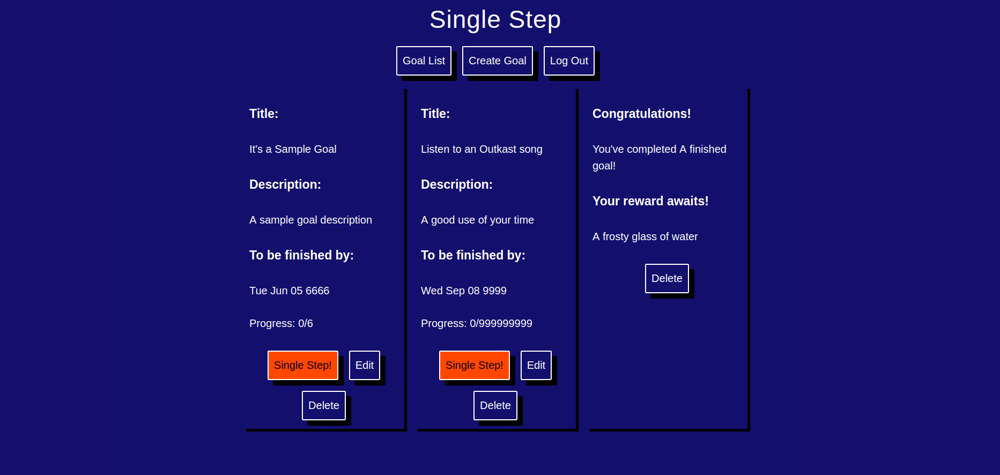
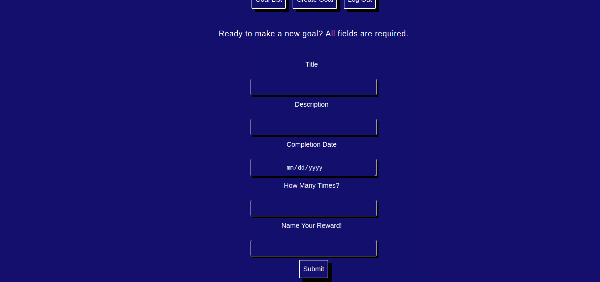

Single Step

Live at https://pure-depths-96483.herokuapp.com/
Server repo https://github.com/jack8191/single-step-server

You may log in for exploratory purposes using
username: test
password: testpassword

After logging in you will see the goal list screen, where in-progress and complete goals live.
Here you can create a new goal, edit an in-progress goal, or delete a goal.

Editing and creating goals both use forms nearly identical. The differences is that all fields are required when creating a goal and the goal to be edited displays above the relevant form. 

I created this project to be a subject-agnostic habit-forming aid. Even taken further this project should always be light on metadata and complexity to contrast with more spcific activity tracking tools.

This project uses a React/Redux frontend and for the backend uses node.js, express, and mongo/oose.
Both use travisCl for testing, the frontend using enzyme where the backend uses mocha and chai. Both use heroku for deployment.

